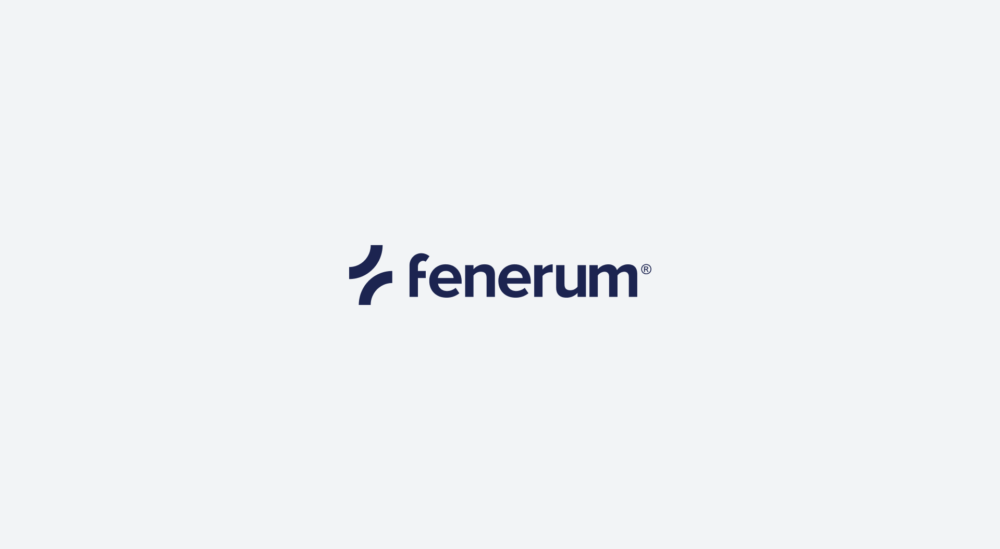
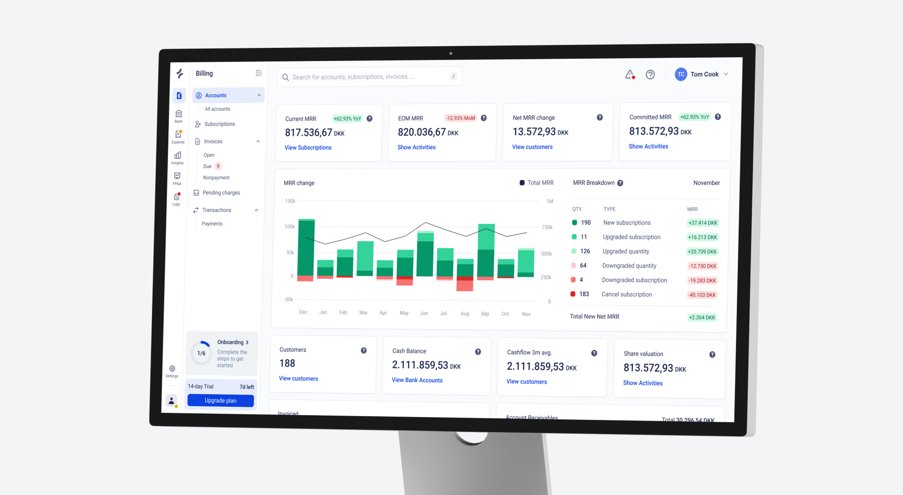
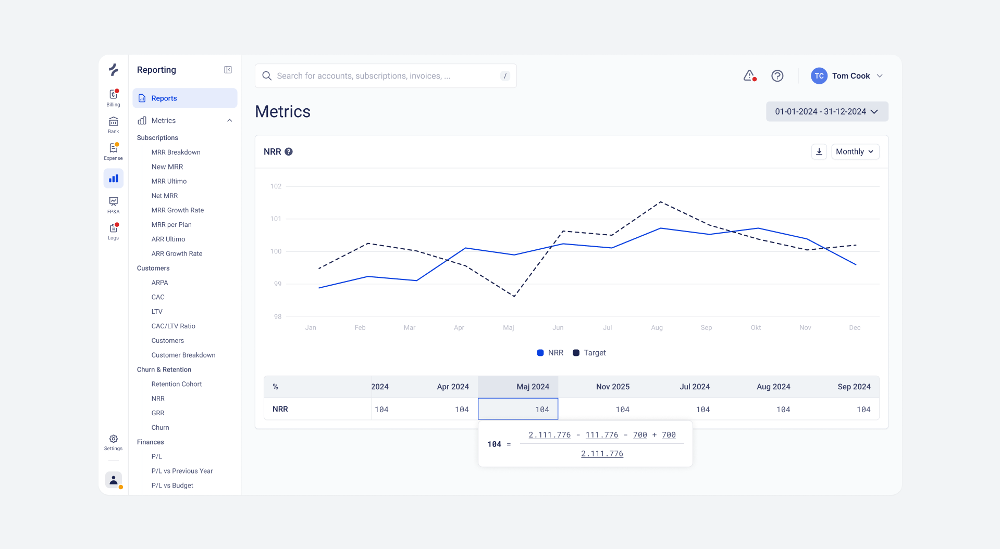
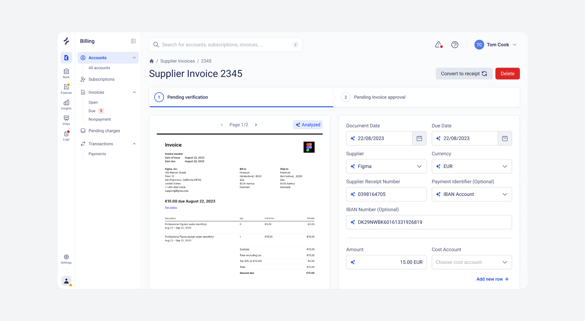

## Overview

<a href="https://fenerum.com" target="_blank">Fenerum</a> is a subscription billing and revenue management platform that automates the whole cycle from subscriptions and invoicing to payments and recurring revenue reporting.

As co-founder of Fenerum my main focus is the product, all the way from brand, visual language and core experience to features, product development and planning.

## Credits




