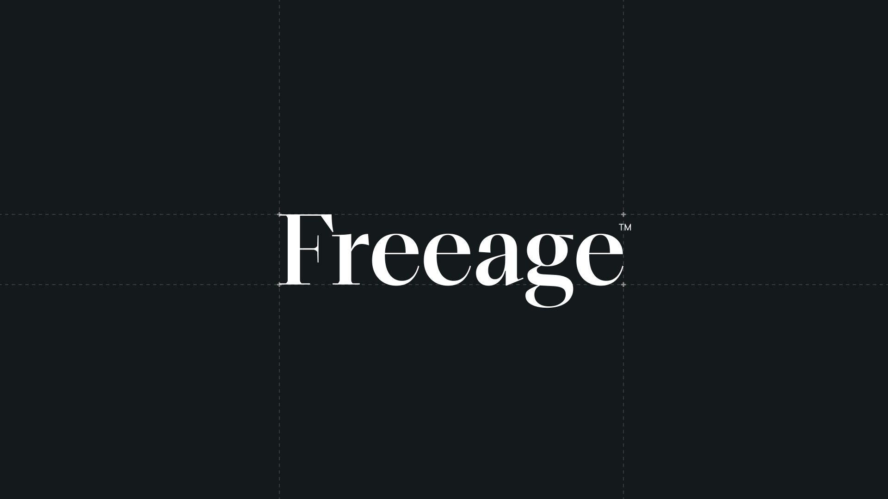
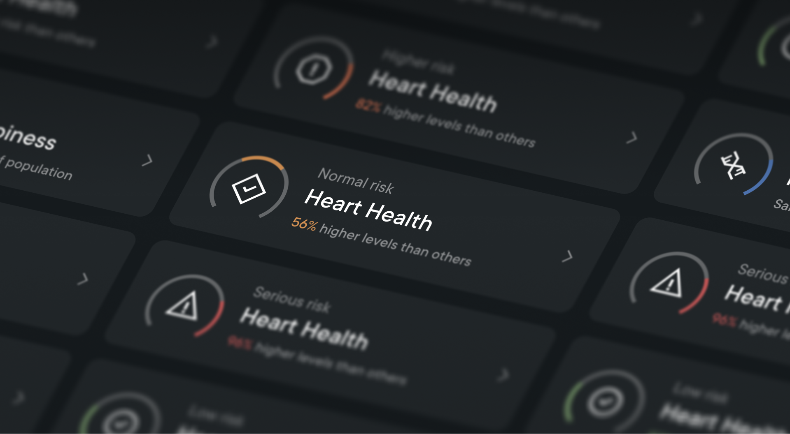
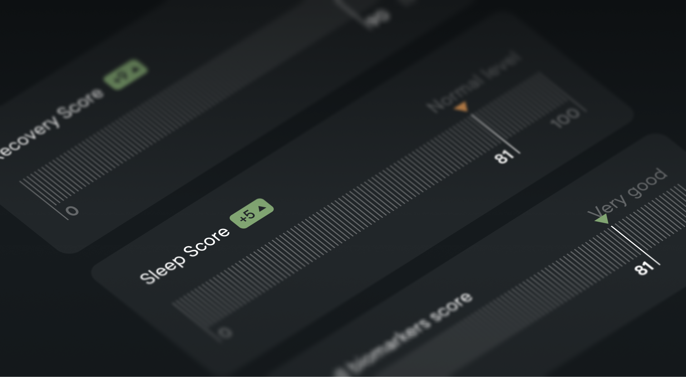
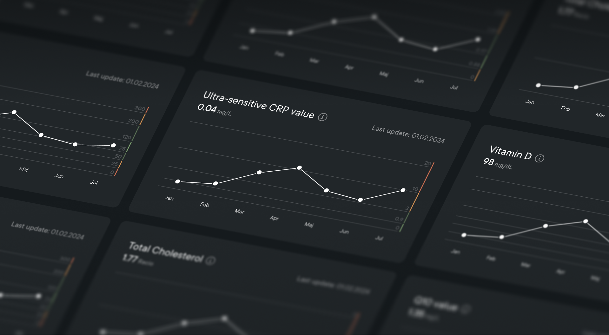

## Overview

Freeage is a HealthTech service providing personalized health strategies for individuals based on data-driven, actionable insight. They combine advanced biological testing with personalized coaching to help individuals optimize their healthspan.

I was brought in as freelancer to assist in shaping the company's visual language and design the core experience of their customer facing health and longevity platform.

## Risk indicators

An essential part of the interface was the risk indicators. We had to turn complex biometrics into glanceable insights that the user can act on rather than decode. This was solved with a simple set of risk indicators paired with plain-language labels that were implemented throughout the platform.

## Health widgets

A family of custom widgets visualizes each type of data in the way that suits it best, from at-a-glance score gauges to trend graphs that track values over time, all sharing the same visual language to keep the system coherent.

## Credits




