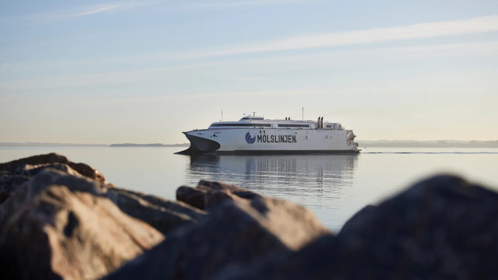
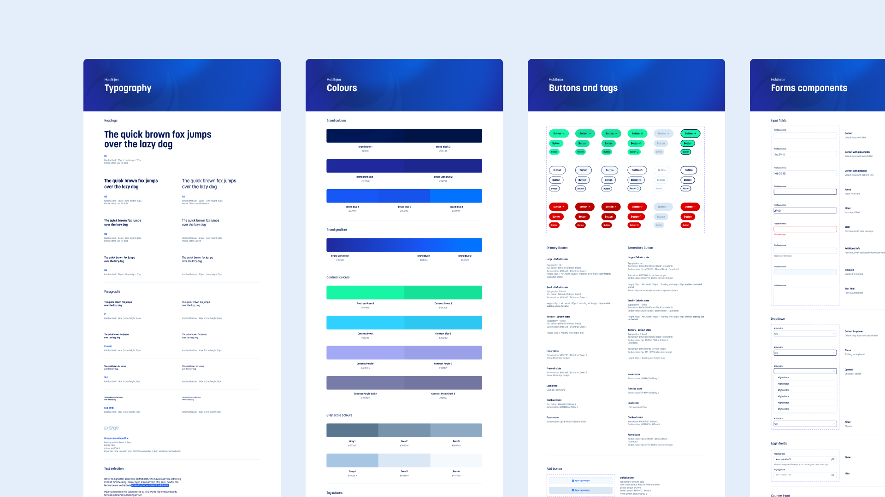
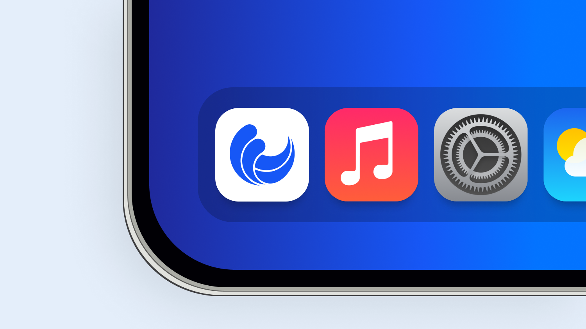

## Overview

<a href="https://www.molslinjen.dk/" target="_blank">Molslinjen</a> is Denmark's largest domestic ferry operator. To meet new strategic goals, they set out to give passengers a better digital experience and make it consistent across every platform.

Working at <a href="https://www.knowit.dk" target="_blank">Knowit</a>, I built a cohesive design system to unify the experience across platforms, and assisteed in crafting components and animations for a new app.

## Design system

Knowit was tasked to elevate Molslinjen's design language and i translated this in into a design system built to scale across platforms and media, covering typography, spacing, color, buttons, inputs and much more.

## Application

We also created a new iOS and Android app that puts a better digital experience directly in passengers hands. I assisted in design the components and animations that bring the interface to life.

## Awards
- <a href="https://danishdigitalaward.dk" target="_blank">Danish Digital Awards</a> · Best in Digital Design · Shortlisted · 2025
- <a href="https://danishdigitalaward.dk" target="_blank">Danish Digital Awards</a> · Digital Design · Shortlisted · 2023
