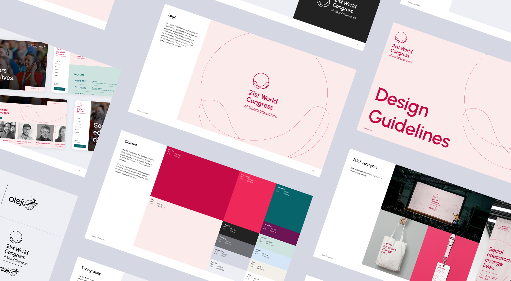
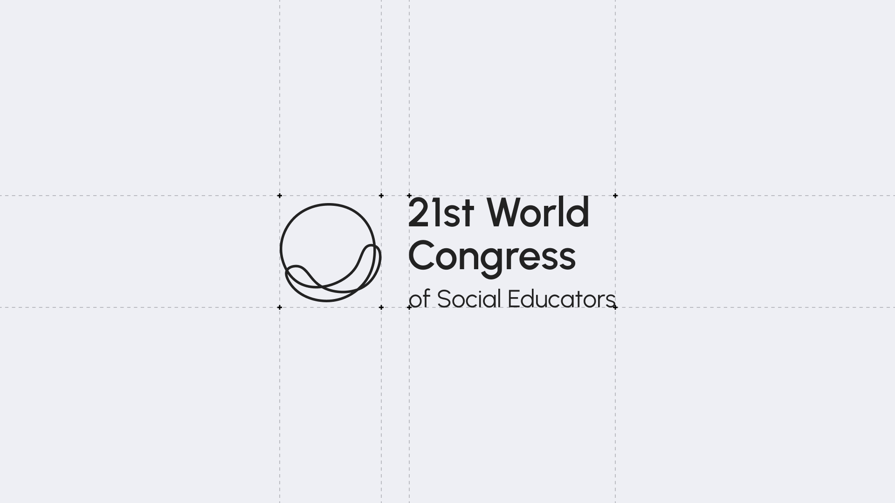
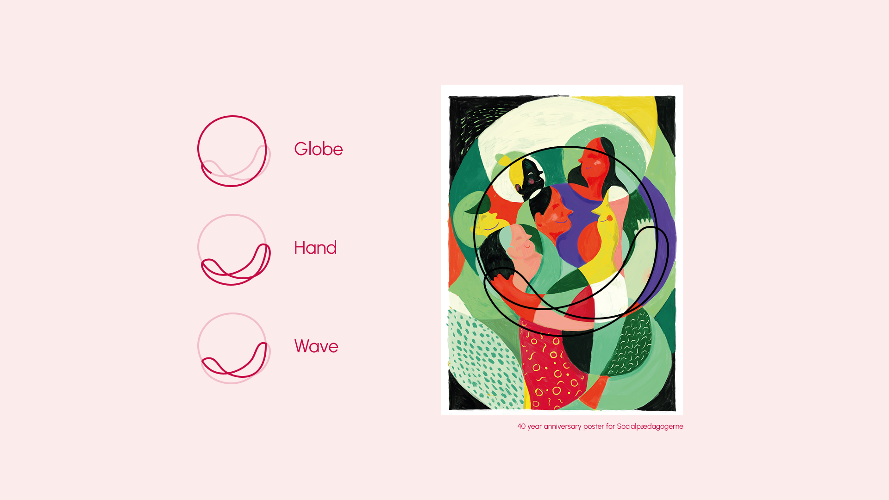

## Overview

<a href="https://sl.dk" target="_blank">Socialpædagogerne</a> is the Danish trade union for social educators. In 2025 they had the honor of hosting the <a href="https://aieji2025.com/en/" target="_blank">21st World Congress of Social Educators</a>, the biggest gathering of social educators globally. 

Working at <a href="https://1508.dk" target="_blank">1508</a>, I was brought in as design lead to create the conference’s visual identity, delivered as a comprehensive design guide that would become the single source of truth for every stakeholder bringing the event to life. 

## Logo

The logo resembles an imperfect globe held in the palm of a hand, drawn as a single, continuous wavy line that reflects the ever-changing nature of the profession. Its form takes inspiration from Socialpædagogerne’s 40-year anniversary poster.

## Design guide

The design guide covered logo placement, variations and lockups, along with color, typography, and examples of how to implement the visual language across both digital and print.

## Awards





## Credits





