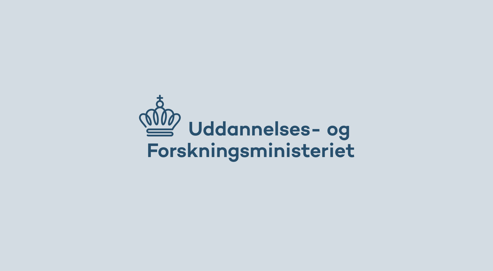
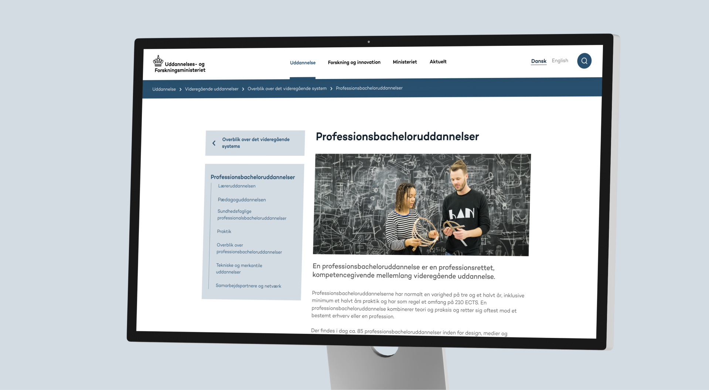

## Overview

<a href="https://ufm.dk" target="_blank">Uddannelses- og Forskningsministeriet</a> is the Danish Ministry of Higher Education and Science. Its website is a large-scale information site serving students, researchers, institutions and the press.

Working at <a href="https://www.knowit.dk" target="_blank">Knowit</a>, we were tasked with redesigning the site's information architecture and updating its visual language based on a predefined design guide, delivered as a lite redesign of the website.

## Information architecture

With a site this large, the real challenge was in the structure. We focused heavily on UX and information architecture across page layouts, sub pages, navigation, breadcrumbs, footer and search, so every page tells you where you are and where to go next.

## Navigation

The main navigation was rebuilt from the ground up. Instead of a sprawling mega menu, it opens into a single panel that reveals one level at a time, so you can drill into a deep section without losing sight of the page behind it. On mobile the same structure folds into a stepped menu.

## Credits





